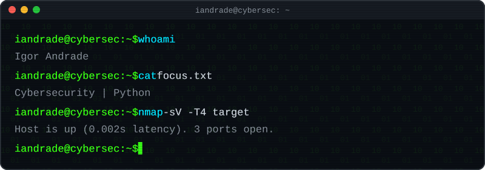

  

 

### `$ cat about.txt`

Building tools and automations for cybersecurity, mostly in Python.

### `$ cat stats.log`

  
  

### `$ ls projects/`

<!-- PROJECTS:START -->

  
  

<!-- PROJECTS:END -->

### `$ cat contact.txt`

